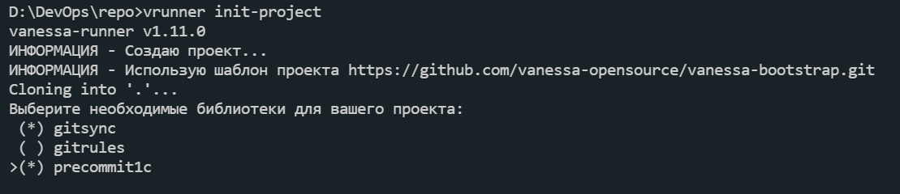

<a id="markdown-автоматизация-повседневных-операций-1с-разработчика" name="автоматизация-повседневных-операций-1с-разработчика"></a>
# Автоматизация повседневных операций 1С разработчика

[](https://t.me/vanessa_opensource_chat)
[](https://github.com/vanessa-opensource/vanessa-runner/releases) 
[](https://github.com/vanessa-opensource/vanessa-runner/actions/workflows/testing.yml)
[](https://sonar.openbsl.ru/dashboard?id=vanessa-runner) 
[](https://sonar.openbsl.ru/dashboard?id=vanessa-runner)
[](https://sonar.openbsl.ru/dashboard?id=vanessa-runner)
[](https://sonar.openbsl.ru/dashboard?id=vanessa-runner) 

<!-- [](https://sonar.openbsl.ru/dashboard?id=vanessa-runner) [](https://sonar.openbsl.ru/dashboard?id=vanessa-runner) [](https://sonar.openbsl.ru/dashboard?id=vanessa-runner) -->

<!-- TOC -->

- [Автоматизация повседневных операций 1С разработчика](#автоматизация-повседневных-операций-1с-разработчика)
  - [Описание](#описание)
- [Автоматизация повседневных операций 1С разработчика](#автоматизация-повседневных-операций-1с-разработчика-1)
- [Описание](#описание-1)
  - [Установка](#установка)
  - [Использование](#использование)
    - [Создание проекта](#создание-проекта)
      - [Примеры создания проекта](#примеры-создания-проекта)
        - [1. Создание проекта по указанному шаблону](#1-создание-проекта-по-указанному-шаблону)
        - [2. Создание проекта по файлу настроек](#2-создание-проекта-по-файлу-настроек)
        - [3. Сборка обработок при создании проекта](#3-сборка-обработок-при-создании-проекта)
    - [Сборка обработок и конфигураций](#сборка-обработок-и-конфигураций)
    - [Примеры настройки и вызова](#примеры-настройки-и-вызова)
      - [1. Создание ИБ из последней конфигурации хранилища 1С, обновление в режиме Предприятия и первоначальное заполнение ИБ](#1-создание-иб-из-последней-конфигурации-хранилища-1с-обновление-в-режиме-предприятия-и-первоначальное-заполнение-иб)
      - [2. Вызов модульных тестов через Vanessa-ADD (TDD)](#2-вызов-модульных-тестов-через-vanessa-add-tdd)
      - [3. Вызов проверки поведения через Vanessa-ADD (BDD)](#3-вызов-проверки-поведения-через-vanessa-add-bdd)
      - [4. Переопределение аргументов запуска](#4-переопределение-аргументов-запуска)
      - [Переопределение переменной окружения](#переопределение-переменной-окружения)
        - [Установка значения](#установка-значения)
      - [Шаблонные переменные](#шаблонные-переменные)
    - [Вывод отладочной информации](#вывод-отладочной-информации)
      - [Примеры](#примеры)
    - [Дополнительные обработки для режима 1С:Предприятие](#дополнительные-обработки-для-режима-1спредприятие)
    - [Дополнительная настройка различных команд](#дополнительная-настройка-различных-команд)
      - [Настройка синтаксической проверки](#настройка-синтаксической-проверки)
      - [Настройка режимов реструктуризации при обновлении конфигурации БД](#настройка-режимов-реструктуризации-при-обновлении-конфигурации-бд)

<!-- /TOC -->

<a id="markdown-описание" name="описание"></a>
## Описание
Автоматизация повседневных операций 1С разработчика
==

Описание
===

Консольное приложение проекта `oscript.io` для автоматизации различных операции для работы с `cf/cfe/epf` файлами, а также автоматизация  запуска сценариев поведения (BDD) и тестов из фреймворка [Vanessa-ADD](https://github.com/vanessa-opensource/add).

Предназначено для организации разработки 1С в режиме, когда работа в git идет напрямую с исходниками или работаем через хранилище 1С.

Позволяет обеспечить единообразный запуск команд "локально" и на серверах сборки `CI-CD`

<a id="markdown-установка" name="установка"></a>
## Установка

используйте пакетный менеджер `opm` из стандартной поставки дистрибутива `oscript.io`

```cmd
opm install vanessa-runner
```

при установке будет создан исполняемый файл `vrunner` в каталоге `bin` интерпретатора `oscript`.

После чего доступно выполнение команд через командную строку `vrunner <имя команды>`

<a id="markdown-использование" name="использование"></a>

## Использование

Ключ `help` покажет справку по параметрам.

```cmd
vrunner help
```

или внутри батника (**ВАЖНО**) через `call`
```cmd
call vrunner help
```

Основной принцип - запустили bat файл с настроенными командами и получили результат.

<a id="markdown-создание-проекта" name="создание-проекта"></a>
### Создание проекта

С помощью команды `init-project` можно создать структуру проекта следующими командами:

```cmd
vrunner init-project 
```


Команда клонирует шаблон <a href="https://github.com/vanessa-opensource/vanessa-bootstrap">vanessa-bootstrap</a> и предложит для установки три библиотеки для проекта:

- <a href="https://github.com/oscript-library/gitsync">gitsync</a>
- <a href="https://github.com/otymko/gitrules">gitrules</a>
- <a href="https://github.com/xDrivenDevelopment/precommit1c">precommit1c</a>

#### Примеры создания проекта

#### 1. Создание проекта по указанному шаблону

```cmd
vrunner init-project --template https://github.com/user/myrepo.git
```
`--template` cсылка на шаблон, из которого будет клонироваться проект.

При использовании ключа `--template` клонируется указанный шаблон, считываются пакеты из env файла шаблона, если пакеты не заданы предлагаются библиотеки по умолчанию.

#### 2. Создание проекта по файлу настроек

```cmd
vrunner init-project --settings my-path/env.json
```

`--settings` путь к файлу env. <a href="examples/example.env.json" target="_blank">Пример файла настроек</a>.

Добавлены следующие настройки:

```json
{
 "init-project": {
        "ШаблонПроекта": {
            "Использовать": true,
            "Репозиторий": "https://github.com/vanessa-opensource/vanessa-bootstrap.git"
        },
        "Пакеты": [
            {
                "Имя": "gitsync",
                "Использовать": true,
                "Установка": [
                    "opm install gitsync"
                ]
            },
            {
                "Имя": "gitrules",
                "Использовать": true,
                "Установка": [
                    "opm install gitrules",
                    "gitrules install"
                ]
            },
            {
                "Имя": "precommit1c",
                "Использовать": false,
                "Установка": [
                    "opm install precommit1c",
                    "precommit1c --install"
                ]
            }
        ]
    }
}
```

Для установки пакетов `gitrules` и `precommit1c` последовательно выполняются указанные команды.

При использовании ключа `--settings` считываются пакеты из указанного файла env, если пакеты не заданы предлагаются библиотеки по умолчанию.

#### 3. Сборка обработок при создании проекта

Вы можете объединить несколько команд в файл `cmd / bat` и указать его как пакет:
```json
       "Пакеты": [
            {
                "Имя": "compile",
                "Использовать": true,
                "Установка": [
                    "compileEpf.cmd"
                ]
            }
        ]
```
В данном примере будут собраны обработки при создании проекта. Содержимое файла `compileEpf.cmd`:
```cmd
call vrunner compileepf src/tools tools/epf/utils
call vrunner compileepf src/tests tests/smoke 
call vrunner compileepf src/epf tools/epf
```

<a id="markdown-сборка-обработок-и-конфигураций" name="сборка-обработок-и-конфигураций"></a>
### Сборка обработок и конфигураций

Для сборки обработок необходимо иметь установленный oscript в переменной PATH и платформу выше 8.3.8

В командной строке нужно перейти в каталог с проектом и выполнить ```tools\compile_epf.bat```, по окончанию в каталоге build\epf должны появиться обработки.
Вся разработка в конфигураторе делается в каталоге build, по окончанию доработок запускаем ```tools\decompile_epf.bat```

Обязательно наличие установленного v8unpack версии не ниже 3.0.38 в переменной PATH.
  - Установку можно взять в релизах утилиты - https://github.com/e8tools/v8unpack/releases
  - Подробнее про утилиту v8unpack - https://github.com/e8tools/v8unpack

<a id="markdown-примеры-настройки-и-вызова" name="примеры-настройки-и-вызова"></a>
### Примеры настройки и вызова

<a id="markdown-1-создание-иб-из-последней-конфигурации-хранилища-1с-обновление-в-режиме-предприятия-и-первоначальное-заполнение-иб" name="1-создание-иб-из-последней-конфигурации-хранилища-1с-обновление-в-режиме-предприятия-и-первоначальное-заполнение-иб"></a>
#### 1. Создание ИБ из последней конфигурации хранилища 1С, обновление в режиме Предприятия и первоначальное заполнение ИБ


`1с-init.cmd` :

```bat
@rem Полная инициализация из репозитария, обновление в режиме Предприятия и начальное заполнение ИБ ./build/ibservice

@rem Пример запуска 1с-init.cmd storage-user storage-password

@chcp 65001

@set RUNNER_IBNAME=/F./build/ibservice

@call vrunner init-dev --storage --storage-name http:/repo-1c --storage-user %1 --storage-pwd %2

@call vrunner run --command "ЗапуститьОбновлениеИнформационнойБазы;ЗавершитьРаботуСистемы;" --execute $runnerRoot\epf\ЗакрытьПредприятие.epf

@call vrunner vanessa --settings tools/vrunner.first.json

@rem Если убрать комментарий из последней строки, тогда можно выполнять полный прогон bdd-фич
@rem @call vrunner vanessa --settings tools/vrunner.json
```

#### 2. Вызов модульных тестов через Vanessa-ADD (TDD)

+ запуск `vrunner xunit tests --settings tools/vrunner.json`
  + или внутри батника
    + `call vrunner xunit --settings tools/vrunner.json`

+ пример vrunner.json:

```json
{
    "default": {
        "--ibconnection": "/F./build/ib",
        "--db-user": "Администратор",
        "--db-pwd": "",
        "--ordinaryapp": "-1"
    },
    "xunit": {
        "--xddConfig": "tools/JSON/xUnitParams.json",
        "testsPath": "tests/smoke",
        "--reportsxunit": "ГенераторОтчетаJUnitXML{build/smoke/junit/xddreport.xml};ГенераторОтчетаAllureXML{build/smoke/allure/allure-testsuite.xml}",
        "--xddExitCodePath": "build/xddExitCodePath.txt",
        "--testclient": "Автотест:123:48223",
        "--testclient-additional" : "/iTaxi"
    }
}
```

Формат файла настройки (в примере xUnitParams.json) для тестов смотрите в [справке Vanessа-ADD](https://github.com/vanessa-opensource/add/tree/develop/tests/smoke#%D0%BD%D0%B0%D1%81%D1%82%D1%80%D0%BE%D0%B9%D0%BA%D0%B0-%D0%B4%D1%8B%D0%BC%D0%BE%D0%B2%D1%8B%D1%85-%D1%82%D0%B5%D1%81%D1%82%D0%BE%D0%B2-%D0%BF%D0%BE%D0%B4-%D0%BA%D0%BE%D0%BD%D0%BA%D1%80%D0%B5%D1%82%D0%BD%D1%83%D1%8E-%D0%BA%D0%BE%D0%BD%D1%84%D0%B8%D0%B3%D1%83%D1%80%D0%B0%D1%86%D0%B8%D1%8E)

Подсказка из командной строки
```
vrunner xunit <testsPath> [прочие-ключи] ...
 <testsPath> - [env RUNNER_TESTSPATH] Путь к каталогу или к файлу с тестами - tests\ТестыПродаж или tests\ТестыПродаж\ТестОптовойПродажи.epf
или к встроенным тестам (общие модули из тестовых расширений или подсистемы\обработки из конфигурации), если явно указан ключ --config-tests.                                                  
Если тесты в виде общих клиентских или серверных модулей в расширениях\конфигурации, то указать просто имя расширения или имя конфигурации. например, Тесты_Продажи или ADD_TDD.
Возможные варианты указания подсистемы или конкретного теста:                                                                           
        Метаданные.Подсистемы.Тестовая или Метаданные.Подсистемы.Тестовая.Подсистемы.Подсистема1 или Метаданные.Обработки.Тест                                                                 
Можно использовать переменную $addRoot, означающую каталог установки библиотеки Vanessa-ADD. Например, $addRoot/tests/smoke для запуска дымовых тестов.                                        
 --workspace - [env RUNNER_WORKSPACE] путь к папке, относительно которой будут определяться макросы $workspace. по умолчанию текущий.                                                          
 --config-tests - [env RUNNER_CONFIG_TESTS] загружать тесты, встроенные в конфигурации в указанную подсистему в виде обработок                                                                                  
 --pathxunit - [env RUNNER_PATHXUNIT] путь к внешней обработке, по умолчанию ищу в пакете vanessa-add                                                                                          
 --reportsxunit -     --reportsxunit параметры формирования отчетов в формате вида:      ФорматВыводаОтчета{Путь к файлу отчета};ФорматВыводаОтчета{Путь к файлу отчета}...      
   Пример:  ГенераторОтчетаJUnitXML{build/junit.xml};ГенераторОтчетаAllureXML{build/allure.xml}    
   Пример (англоязычный вариант): GenerateReportJUnitXML{build/junit.xml};GenerateReportAllureXML{build/a
llure.xml}                                                                                                                                                                                     
 --xddExitCodePath - путь к текстовому файлу, обозначающему статус выполнению.    Внутри файла строка-значение 0 (тесты пройдены), 1 (тесты не пройдены)                                       
 --xddConfig - Путь к конфигурационному файлу xUnitFor1c                                                                                                                                       
 --testclient - Параметры подключения к тест-клиенту вида --testclient ИмяПользователя:Пароль:Порт    Пример 1: --testclient Администратор:пароль:1538    Пример 2: --testclient ::1538 (клиент
 тестирования будет запущен с реквизитами менеджера тестирования)                                                                                                                              
 --testclient-additional - Дополнительные параметры, передаваемые приложению 1С при запуске тест-клиента                                                                                       
 --reportxunit - путь к каталогу с отчетом jUnit (устарел)                                                                                                                                     
 --additional - Дополнительные параметры для запуска предприятия.                                                                                                                              
 --no-wait - Не ожидать завершения запущенной команды/действия                                                                                                                                 
 --xdddebug - Выводить отладочные сообщения при прогоне тестов                                                                                                                                 
 --no-shutdown - Не завершать работу 1С:Предприятие после выполнения тестов                                                                                                                    
 ```

<a id="markdown-2-вызов-проверки-поведения-через-vanessa-add" name="2-вызов-проверки-поведения-через-vanessa-add"></a>
#### 3. Вызов проверки поведения через Vanessa-ADD (BDD)

+ запуск `vrunner vanessa --settings tools/vrunner.json`
  + или внутри батника
    + `call vrunner vanessa --settings tools/vrunner.json`

+ пример vrunner.json:

```json
{
    "default": {
        "--ibconnection": "/F./build/ib",
        "--db-user": "Администратор",
        "--db-pwd": "",
        "--ordinaryapp": "-1"
    },
    "vanessa": {
        "--vanessasettings": "./tools/VBParams.json",
        "--workspace": ".",
        "--additional": "/DisplayAllFunctions /L ru"
    }
}
```

+ пример VBParams.json

```json
{
    "ВыполнитьСценарии": true,
    "ЗавершитьРаботуСистемы": true,
    "ЗакрытьTestClientПослеЗапускаСценариев": true,
    "КаталогФич": "$workspaceRoot/features/01-СистемаУправления",
    "СписокТеговИсключение": [
        "IgnoreOnCIMainBuild",
        "FirstStart",
        "Draft"
    ],
    "КаталогиБиблиотек": [
        "./features/Libraries"
    ],
    "ДелатьОтчетВФорматеАллюр": true,
    "КаталогOutputAllureБазовый": "$workspaceRoot/build/out/allure",
    "ДелатьОтчетВФорматеCucumberJson": true,
    "КаталогOutputCucumberJson": "$workspaceRoot/build/out/cucumber",
    "ВыгружатьСтатусВыполненияСценариевВФайл": true,
    "ПутьКФайлуДляВыгрузкиСтатусаВыполненияСценариев": "$workspaceRoot/build/out/vbStatus.log",
    "ДелатьЛогВыполненияСценариевВТекстовыйФайл": true,
    "ИмяФайлаЛогВыполненияСценариев": "$workspaceRoot/build/out/vbOnline.log"
}
```
Формат файлов настройки и других параметров запуска BDD смотрите в [справке Vanessа-ADD](https://github.com/vanessa-opensource/add/blob/develop/doc/%D0%BD%D0%B0%D1%81%D1%82%D1%80%D0%BE%D0%B9%D0%BA%D0%B8-%D0%BF%D1%80%D0%BE%D1%84%D0%B8%D0%BB%D1%8F-%D0%B7%D0%B0%D0%BF%D1%83%D1%81%D0%BA%D0%B0.md)

Подсказка из командной строки
```
vrunner vanessa --path <bddPath> [прочие-ключи] ...
 --path - Путь для запуска тестов                                                                                              
В параметре <bddPath> можно указывать как каталог с фичами, так и конкретную фичу                                                                    
 --vanessasettings - [env RUNNER_VANESSASETTINGS] путь к файлу настроек фреймворка тестирования                                
 --pathvanessa - [env RUNNER_PATHVANESSA] путь к внешней обработке, по умолчанию <OneScript>/lib/add/bddRunner.epf             
           или переменная окружения RUNNER_PATHVANESSA                                                                         
 --workspace - [env RUNNER_WORKSPACE] путь к папке, относительно которой будут определятся макросы $workspace. по умолчанию текущий.                                                                                         
 --tags-ignore - Теги игнорирования фича-файлов                                                                                
 --tags-filter - Теги отбор фича-файлов                                                                                        
 --additional - Дополнительные параметры для запуска предприятия.                                                              
 --additional-keys - Дополнительные параметры, передаваемые в параметр /С.                                                     
 --no-wait - Не ожидать завершения запущенной команды/действия                                                                 
 ```

<a id="markdown-3-переопределение-аргументов-запуска" name="3-переопределение-аргументов-запуска"></a>
#### 4. Переопределение аргументов запуска

В случае необходимости переопределения параметров запуска используется схема приоритетов.

Приоритет в порядке возрастания (от минимального до максимального приоритета)
+ `env.json (в корне проекта)`
+ `--settings ../env.json (указание файла настроек вручную)`
+ `RUNNER_* (из переменных окружения)`
+ `--* (ключи командной строки)`

Описание:
+ На первоначальном этапе читаются настройки из файла настроек, указанного в ключе команды ```--settings tools/vrunner.json```
+ Потом, если настройка есть в переменной окружения, тогда берем из неe.
+ Если же настройка есть, как в файле json, так и в переменной окружения и непосредственно в командной строке, то берем настройку из командной строки.

Например:

<a id="markdown-переопределение-переменной-окружения" name="переопределение-переменной-окружения"></a>
#### Переопределение переменной окружения

<a id="markdown-установка-значения" name="установка-значения"></a>
##### Установка значения

  1. Допустим, в файле vrunner.json указана настройка
        ```json
        "--db-user":"Администратор"
        ```
        а нам для определенного случая надо переопределить имя пользователя,
        тогда можно установить переменную: ```set RUNNER_DBUSER=Иванов``` и в данный параметр будет передано значение `Иванов`

  2. Очистка значения после установки
        ```cmd
        set RUNNER_DBUSER=Иванов
        set RUNNER_DBUSER=
        ```
        в данном случае установлено полностью пустое значение и имя пользователя будет взято из tools/vrunner.json, если оно там есть.

  3. Установка пустого значения:
        ```cmd
        set RUNNER_DBUSER=""
        set RUNNER_DBUSER=''
        ```

        Если необходимо установить в поле пустое значение, тогда указываем кавычки и в параметр `--db-user` будет установлена пустая строка.

  4. Переопределение через параметры командной строки.

        Любое указание параметра в командной строке имеет наивысший приоритет.

<a id="markdown-шаблонные-переменные" name="шаблонные-переменные"></a>
#### Шаблонные переменные

При указании значений параметров внутри строки с параметром можно использовать шаблонные переменные.
Список таких переменных:

+ workspaceRoot - означает каталог текущего проекта
+ runnerRoot - означает каталог установки Vanessa-Runner
+ addRoot - означает каталог установки библиотеки Vanessa-ADD

<a id="markdown-вывод-отладочной-информации" name="вывод-отладочной-информации"></a>
### Вывод отладочной информации

Управление выводом логов выполняется с помощью типовой для oscript-library настройки логирования через пакет logos.

Основной лог vanessa-runner имеет название ``oscript.app.vanessa-runner``.

<a id="markdown-примеры" name="примеры"></a>
#### Примеры

Включение всех отладочных логов:

```bat
rem только для logos версии >=0.6
set LOGOS_CONFIG=logger.rootLogger=DEBUG

call vrunner <параметры запуска>
```

Если выводится сообщение про неправильные параметры командной строки:

```bat
set LOGOS_CONFIG=logger.oscript.lib.cmdline=DEBUG
call vrunner <параметры запуска>
```

Включит отладочный лог только для библиотеки cmdline, которая анализирует параметры командной строки.

<a id="markdown-дополнительные-обработки-для-режима-1спредприятие" name="дополнительные-обработки-для-режима-1спредприятие"></a>
### Дополнительные обработки для режима 1С:Предприятие

В папке epf есть несколько обработок, позволяющих упростить развертывание/тестирование для конфигураций, основанных на БСП.

+ Основной пример (см. ниже пример вызова) - это передача через параметры `/C` команды `"ЗапуститьОбновлениеИнформационнойБазы;ЗавершитьРаботуСистемы"` и одновременная передача через `/Execute "ЗакрытьПредприятие.epf"`.

  + При запуске с такими ключами подключается обработчик ожидания, который проверяет наличие формы с заголовком обновления и при окончании обновления завершает 1С:Предприятие. Данное действие необходимо для полного обновления информационной базы 1С:Предприятия, пока действует блокировка на фоновые задачи и запуск пользователей.

  + также выполняется отключение запроса при завершении работы программы для БСП-конфигураций

  + код запуска

```bat
  @call vrunner run --command "ЗапуститьОбновлениеИнформационнойБазы;ЗавершитьРаботуСистемы;" --execute $runnerRoot\epf\ЗакрытьПредприятие.epf
```

+ **ЗагрузитьРасширение** позволяет подключать расширение в режиме предприятия и получать результат ошибки. Предназначено для подключения в конфигурациях, основанных на БСП. В параметрах /C передается путь к расширению и путь к файлу лога подключения.

+ **ЗагрузитьВнешниеОбработки** позволяет загрузить все внешние обработки и подключить в справочник "Дополнительные отчеты и обработки", т.к. их очень много то первым параметром идет каталог, вторым параметром путь к файлу лога. Все обработки обновляются согласно версиям.

+ **СозданиеПользователей** позволяет создать первого пользователя-администратора, если в ИБ еще не существует пользователей. Администратор назначается роль `ПолныеПрава`, если она существует в ИБ.

  + также выполняется отключение запроса при завершении работы программы для БСП-конфигураций

  + код запуска для создания пользователя с именем `Администратор`

```bat
      @call vrunner run --command "СоздатьАдминистратора;Имя=Администратор;ЗавершитьРаботуСистемы" --execute $runnerRoot\epf\СоздатьПользователей.epf
```

<a id="markdown-дополнительная-настройка-различных-команд" name="дополнительная-настройка-различных-команд"></a>
### Дополнительная настройка различных команд

<a id="markdown-настройка-синтаксической-проверки" name="настройка-синтаксической-проверки"></a>
#### Настройка синтаксической проверки

Для управления режима синтаксической проверки рекомендуется использовать json-файл настройки.
Для его использования нужно
- установить путь к нему в параметре `VRUNNER_CONF`
- внутри json-файла нужно добавить секцию `syntax-check`
- список всех используемых параметров можно уточнить, выполнив команду `vrunner help syntax-check`
- ссылка на подготовленный файл [examples\example.env.json](./examples/example.env.json)
- также можно передавать параметры синтакс-проверки через командную строку
  - в этом случае режимы проверки должны быть указаны **последним** параметров ком.строки последовательно, через пробел
    -  например, `vrunner syntax-check --groupbymetadata --mode -ExtendedModulesCheck -Server -ThinClient -ExternalConnection`

Пример настройки в файле
```json
{
    "syntax-check": {
        "--groupbymetadata":true,
        "--exception-file":"",
        "--mode": [
            "-ExtendedModulesCheck",
            "-ThinClient",
             "-WebClient",
             "-Server",
             "-ExternalConnection",
             "-ThickClientOrdinaryApplication"
        ]
        // "-Extension" : "ИмяРасширения",
        // "-AllExtensions" : true
    }
}
```

<a id="markdown-настройка-режимов-реструктуризации-при-обновлении-конфигурации-бд" name="настройка-режимов-реструктуризации-при-обновлении-конфигурации-бд"></a>
#### Настройка режимов реструктуризации при обновлении конфигурации БД

Возможно использование специальных режимов реструктуризации `-v1` и `-v2`.

- В режиме командной строки
  - указываются ключи `--v1` и `--v2`. Важно: указать двойной знак `--`, а не одиночный!
  - 3 команды поддерживают эти ключи
    - `init-dev`
    - `update-dev`
    - `updatedb`
  - например, `vrunner updatedb --ibconnection /F./build/ibservice --uccode test --v2`
- в json-файле настройки
  - например,

```json
{
    "updatedb": {
        "--v2": true,
        "--uccode": "test"
    },
    "init-dev": {
        "--v2": true
    }
    },
    "update-dev": {
        "--v2": true
    }
}
```
